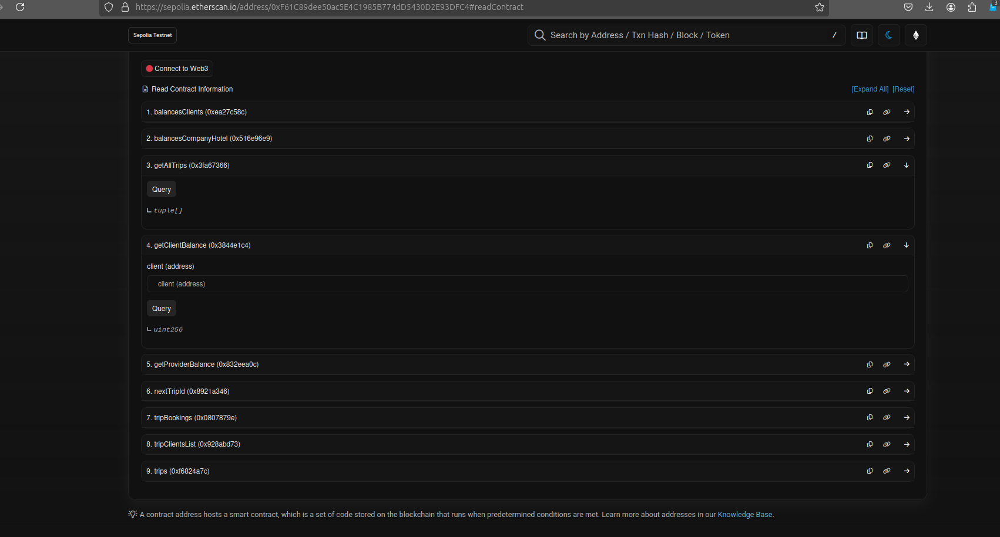
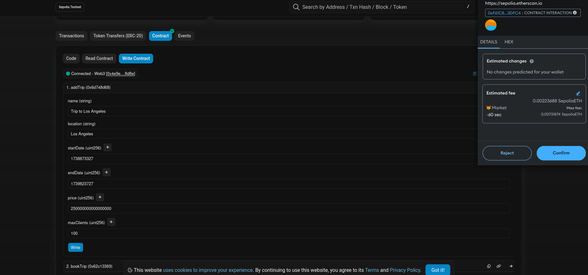

<div align="left" style="position: relative;">

<h1>S2I-ORIZON-SOLIDITY</h1>
<p align="left">

</p>
<p align="left">
	
	
	
	
</p>
<p align="left"><!-- default option, no dependency badges. -->
</p>
<p align="left">
	<!-- default option, no dependency badges. -->
</p>
</div>
<br clear="right">

## Languages Used

This project uses the following languages:

- 
- 
- 

## Development Environment

This project uses the following development environment:

- 

Hardhat is used as the development environment for compiling, deploying, testing, and debugging the smart contracts.

## 🔗 Table of Contents

- [📍 Overview](#-overview)
- [👾 Features](#-features)
- [📁 Project Structure](#-project-structure)
- [🚀 Getting Started](#-getting-started)
  - [☑️ Prerequisites](#-prerequisites)
  - [⚙️ Installation](#-installation)
  - [🤖 Usage](#🤖-usage)
  - [🧪 Testing](#🧪-testing)
- [📌 Project Roadmap](#-project-roadmap)
- [🔰 Contributing](#-contributing)
- [🎗 License](#-license)
- [🙌 Acknowledgments](#-acknowledgments)

---

## 📍 Overview

Orizon, a travel agency specializing in sustainable tourism, aims to create a platform that provides an alternative to centralized travel booking services, which often impose high fees on service providers and prevent direct communication between providers and customers.

To achieve this, Orizon has tasked you with developing a smart contract that can be used for booking such trips, directly connecting travel service providers with customers without intermediary fees.

The project involves creating a Solidity smart contract that regulates the entire booking process. This contract must manage the transfer of payments to travel service providers and ensure that bookings are protected and secure.

---

## 👾 Key Features

- Mapping of travel service provider addresses with their respective balances
- Mapping of customer addresses with their respective balances
- When a customer books a trip, the booking amount is transferred and locked in their balance within the contract until the trip is completed
- The amount paid by a customer is transferred to the respective provider's balance at the end of the trip
- If the customer decides to cancel a booking before the departure date, the locked amount is refunded to their account
- Return the current balance of the customer or travel service provider
- Allow the travel service provider to withdraw funds from their balance

---

## 📁 Project Structure

```sh
└── S2I-ORIZON-SOLIDITY/
    ├── README.md
    ├── contracts
    │   ├── TravelLibrary.sol
    │   └── TripManager.sol
    ├── hardhat.config.ts
    ├── ignition
    │   └── modules
    ├── note.txt
    ├── package-lock.json
    ├── package.json
    ├── scripts
    │   └── utils.ts
    ├── test
    │   └── TestTripManager.t.ts
    ├── toDo.txt
    └── tsconfig.json
```

---

## 🚀 Getting Started

### ☑️ Prerequisites

Before getting started with S2I-ORIZON-SOLIDITY, ensure your runtime environment meets the following requirements:

- **Programming Language:** TypeScript
- **Package Manager:** Npm

### ⚙️ Installation

Install S2I-ORIZON-SOLIDITY using one of the following methods:

**Build from source:**

1. Clone the S2I-ORIZON-SOLIDITY repository:

```sh
❯ git clone https://github.com/boobaGreen/S2I-ORIZON-SOLIDITY
```

2. Navigate to the project directory:

```sh
❯ cd S2I-ORIZON-SOLIDITY
```

3. Install the project dependencies:

**Using `npm`** &nbsp; [](https://www.npmjs.com/)

```sh
❯ npm install
```

### Usage

The TripManager contract has already been deployed and verified on the Sepolia network. You can interact with the contract directly using MetaMask and the Etherscan interface.

#### Steps to interact with the contract

1. **Add the Sepolia network to MetaMask:**:

   - Open MetaMask and go to the "Networks" section.
   - Select SEPOLIA network if not showed enable the `show test network` button

2. **Access the contract on Etherscan:**:

   - Go to the contract page on Etherscan: [TripManager on Sepolia](https://sepolia.etherscan.io/address/0xF61C89dee50ac5E4C1985B774dD5430D2E93DFC4)

3. **Read and write to the contract:**:
   - On the contract page on Etherscan, go to the "Contract" tab.
   - You can use the "Read Contract" and "Write Contract" sections to interact with the contract.

#### Example usage

##### Reading contract data

1. Go to the "Contract" tab and select "Read Contract".
2. Find the function you want to call, for example, `getAllTrips`.
3. Click on "Query" to execute the function and view the results.Click on "Query" to execute the function and view the results.



##### Writing data to the contract

1. Go to the "Contract" tab and select "Write Contract".
2. Connect MetaMask by clicking on "Connect to Web3".
3. Find the function you want to call, for example, `addTrip`.
4. Enter the required parameters and click on "Write" to execute the function.



#### Available functions

##### Write functions

- **addTrip**: Adds a new trip.
- **bookTrip**: Books a trip.
- **cancelTrip**: Cancels a booking.

##### Funzioni di lettura

- **balancesClients**: Returns the balance of clients.
- **balancesCompanyHotel**: Returns the balance of the company/hotel.
- **getAllTrips**: Returns all trips.
- **getClientBalance**: Returns the balance of a client.
- **getProviderBalance**: Returns the balance of a provider.
- **nextTripId**: Returns the next trip ID.
- **tripBookings**:Returns the bookings of a trip.
- **tripClientsList**: Returns the list of clients of a trip.
- **trips**: Returns the details of a trip.

#### Adding a trip

To add a trip, you need to use the JavaScript notation in epoch time. If you want to convert a date from human-readable to epoch time, you can use this free site that offers this service quickly without registration: [Date to Epoch Converter](https://esqsoft.com/javascript_examples/date-to-epoch).

#### IContract address

- **Sepolia**: `0x5FbDB2315678afecb367f032d93F642f64180aa3`

#### Contract verification

The contract has been verified on Etherscan, which means you can view the source code and interact with it directly through the Etherscan interface.

### Deployment

#### Local or Sepolia Deployment using Ignition Module

If you want to deploy the `TripManager` contract locally or on Sepolia, you can use Hardhat Ignition. Follow the steps below to configure and execute the deployment.

##### Using the Existing Deployment Script

The deployment script `IgnitionDeploy.ts` is already present in the `scripts` folder of the project. This script uses Hardhat Ignition to deploy the `TripManager` contract.

##### Running the Deployment

To deploy the contract, use one of the following commands:

- **Start a local node**:

  Open a terminal and run the following command to start a local Hardhat node:

  ```sh
  npx hardhat node
  ```

  Leave this terminal open and running.

- **Local Deployment**:

  Open another terminal and use one of the following commands to deploy the contract:

  ```sh
  npx hardhat ignition deploy ignition/modules/TripManager.ts --network localhost
  ```

- **Sepolia Deployment with verification**:

  ```sh
  npx hardhat ignition deploy ignition/modules/TripManager.ts --network sepolia --verify
  ```

#### Funding addresses

When deploying locally, the Sepolia private keys specified in the .env file will also be used. During local deployment, these accounts will be assigned 100 ETH by IgnitionDeploy and Hardhat cheat. However, for deploying on Sepolia, you will need to use faucets to obtain Sepolia ETH (SEPOLIA ETH).

#### Note on Deployment Address

The deployment will use the addresses and keys specified in the .env file. Make sure these keys are set correctly:

```sh

 SEPOLIA_PRIVATE_KEY=1111111111111111111111111111111111111111111111111111111111111111
 PROVIDER_PRIVATE_KEY=2222222222222222222222222222222222222222222222222222222222222222
 CLIENT_PRIVATE_KEY=3333333333333333333333333333333333333333333333333333333333333333
 INFURA_PROJECT_ID=your_infura_project_id
 ETHERSCAN_API_KEY=your_etherscan_api_key

```

You can find a `.envfake` file to guide you in creating your own `.env` file. You can also fill it with your data and then rename it to `.env`.

#### Folders Created by Hardhat Ignition

After running the deployment, Hardhat Ignition creates folders in the ignition/deployments directory to keep track of the deployed contracts. These folders contain the following files:

- journal.jsonl: This file logs every operation performed during the deployment, allowing Hardhat Ignition to resume the deployment in case of errors.

- deployed_addresses.json: This file maps each deployed contract to its address. Example content:

```sh
{
  "TripManagerModule#TripManager": "0x5FbDB2315678afecb367f032d93F642f64180aa3"
}
```

- artifacts: This folder contains the artifacts of the deployed contracts, without subfolders, and the files are named based on the Future ID that created them.

#### Conclusion

By following these steps, you can deploy the TripManager contract locally or on Sepolia using Hardhat Ignition. Make sure to configure the files correctly and use the appropriate commands to execute the deployment.

### 🧪 Testing

Run the test suite using the following command:
**Using `npm`** &nbsp; [](https://www.npmjs.com/)

```sh
❯ npx hardhat test
```

#### ✅ Test Cases

```
TripManager
    ✔ should close a trip with multiple clients and transfer funds to the provider
    Add Trip
      ✔ should add a new trip
      ✔ should add a new trip
      ✔ should add a trip with start date and end date two days apart
      ✔ should add a trip with start date and end date three days apart
    Book Trip
      ✔ should book a trip
      ✔ should revert if trip starts in less than a day
      ✔ should revert if trip has already started
      ✔ should revert if trip has already ended
      ✔ should revert if not enough funds to book the trip
      ✔ should revert if trip is already booked
      ✔ should revert if trip is fully booked
      ✔ should revert if trip does not exist
    Cancel Trip
      ✔ should cancel a trip within the allowed time
      ✔ should revert if trying to cancel a trip less than 1 day before start
      ✔ should revert if trying to cancel a trip that has already started
      ✔ should cancel a trip within the allowed time and update client balance
    Close Trip
      ✔ should close a trip and transfer funds to the provider
      ✔ should revert if trying to close a trip that has not ended yet
      ✔ should revert if trying to close a trip by a non-provider
      ✔ should revert if trying to close a trip that does not exist
      ✔ should revert if trying to close a trip that has already been closed
      ✔ should close a trip with multiple clients and transfer funds to the provider
    Withdraw Funds
      ✔ should allow the provider to withdraw funds
      ✔ should revert if there are no funds to withdraw


    23 passing (3s)
```

---

### 📌 Project Roadmap

- [x] **`Phase 1`**: Setup Development Environmen

  - Install and configure Hardhat.
  - Set up the project structure and dependencies.

- [x] **`Phase 2`**: Develop Smart Contract

  - Create the main smart contract `TripManager.sol`.
  - Implement the following features:
    - Mapping of travel service provider addresses with their respective balances.
    - Mapping of customer addresses with their respective balances.
    - Ensure that when a customer books a trip, the booking amount is transferred and locked in their balance within the contract until the trip is completed.
    - Transfer the amount paid by a customer to the respective provider's balance at the end of the trip.
    - Implement cancellation logic to refund the locked amount to the customer's account if they cancel before the departure date.
    - Add a maximum number of clients for each trip to avoid overbooking.
    - Ensure that the trip can be of any duration, including starting and ending on the same day.

- [x] **`Phase 3`**:Enhance Security and Functionality

  - Add `tripBookings` mapping to prevent clients from canceling trips they did not book.
    - `mapping(address => mapping(uint256 => bool)) public tripBookings;`
  - Add `tripClientsList` mapping to help the `closeTrip` function identify which clients have funds to be transferred to the provider at the end of the trip.
    - `mapping(uint256 => address[]) public tripClientsList;`
  - Ensure that cancellations must occur at least one day before the trip starts to give providers time to organize.
  - Implement logic to ensure that only providers can withdraw funds, as client funds are either locked for a trip or refunded upon cancellation.

- [x] **`Phase 4`**: Develop and Integrate Library

  - Create `TravelLibrary.sol` to handle common operations and events.
  - Implement the following features in the library:
    - Emit events for trip addition, booking, and cancellation.
    - Add functions to handle trip addition, booking, and cancellation.
    - Add functions to check if a trip has ended and if it can be closed.
    - Ensure the library is used within the `TripManager.sol` contract.

- [x] **`Phase 5`**: Testing in Local

  - Write comprehensive tests for all functionalities using Hardhat.
  - Create utils.ts with scripts for creating default trips.
  - Ensure all edge cases are covered, including booking, cancellation, and fund transfers.
  - Deploy the smart contract to the blockchain.

- [x] **`Phase 6`**: Deploy and Verify on Sepolia

  - Deploy the smart contract to the Sepolia testnet.
  - Verify the smart contract with Etherscan

- [x] **`Phase 7`**: Documentation and Finalization

  - Document the smart contract and its functions.
  - Update the README with usage instructions, testing procedures, and project details.
  - Finalize and review the project for any improvements or optimizations.
  - Create a detailed presentation in PDF format to explain the project to the client.
  - Include all relevant information, diagrams, and explanations of the smart contract functionalities.

- [ ] **`Future Implementation`**: Create a Simple Frontend
  - Develop a simple frontend application to utilize all functions and the flow of the contract and library.
  - Ensure the frontend is user-friendly and effectively demonstrates the capabilities of the smart contract.

---

## 🔰 Contributing

- **💬 [Join the Discussions](https://github.com/boobaGreen/S2I-ORIZON-SOLIDITY/discussions)**: Share your insights, provide feedback, or ask questions.
- **🐛 [Report Issues](https://github.com/boobaGreen/S2I-ORIZON-SOLIDITY/issues)**: Submit bugs found or log feature requests for the `S2I-ORIZON-SOLIDITY` project.
- **💡 [Submit Pull Requests](https://github.com/boobaGreen/S2I-ORIZON-SOLIDITY/blob/main/CONTRIBUTING.md)**: Review open PRs, and submit your own PRs.

<details closed>
<summary>Contributing Guidelines</summary>

1. **Fork the Repository**: Start by forking the project repository to your github account.
2. **Clone Locally**: Clone the forked repository to your local machine using a git client.
   ```sh
   git clone https://github.com/boobaGreen/S2I-ORIZON-SOLIDITY
   ```
3. **Create a New Branch**: Always work on a new branch, giving it a descriptive name.
   ```sh
   git checkout -b new-feature-x
   ```
4. **Make Your Changes**: Develop and test your changes locally.
5. **Commit Your Changes**: Commit with a clear message describing your updates.
   ```sh
   git commit -m 'Implemented new feature x.'
   ```
6. **Push to github**: Push the changes to your forked repository.
   ```sh
   git push origin new-feature-x
   ```
7. **Submit a Pull Request**: Create a PR against the original project repository. Clearly describe the changes and their motivations.
8. **Review**: Once your PR is reviewed and approved, it will be merged into the main branch. Congratulations on your contribution!
</details>

<details closed>
<summary>Contributor Graph</summary>
<br>
<p align="left">
   <a href="https://github.com{/boobaGreen/S2I-ORIZON-SOLIDITY/}graphs/contributors">
      
   </a>
</p>
</details>

---

## 🎗 License

This project is licensed under the [MIT License](https://opensource.org/licenses/MIT). For more details, refer to the [LICENSE](https://opensource.org/licenses/MIT) file.

---

## 🙌 Acknowledgments

- [Solidity Dates and Time Operations](https://soliditytips.com/articles/solidity-dates-time-operations/) - Solidity Dates and Time Operations - An in-depth guide on handling dates and time in Solidity and JavaScript.

- [Hardhad-Ignition](https://hardhat.org/ignition/docs/getting-started#overview/) - Hardhat ignition official documentation

---
